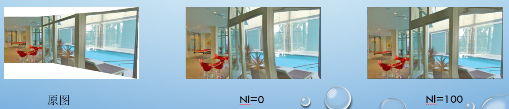

# rectangle-panoramic-image

> Author: Yuchao Gu

> E-mail: 2015014178@buct.edu.cn

> Date: 2018-07-31

> Description: My implementation of 《Rectangling Panoramic Images via Warping》,which is accelerated by OpenGL

- - -

# implementation

## Local Warping

### pipeline

### visiual results

## Global Warping

### shape perservation and line perservation

### line perservation

step 1: detect lines

step 2: segment lines in each quad

line perservation result:

- - -

# what's new

OpenGL has implemented bilinear interpolation, we can use it by texture mapping. To warp image to rectangle with both local and global mesh in the last step, we can simply use OpenGL to get result at a higher speed. My implementation of bilinear interpolation is also provided, which is commented out.

# drawbacks

Our local warping's result isn't good enough. Origin Paper use improved seam carving while we use origin one 

# enviroments

* windows10
* Visual Studio 2017 Debug x64
* Opencv 3.4.0
* OpenGL
* Eigen
