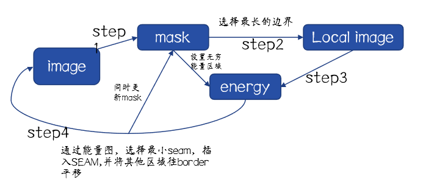
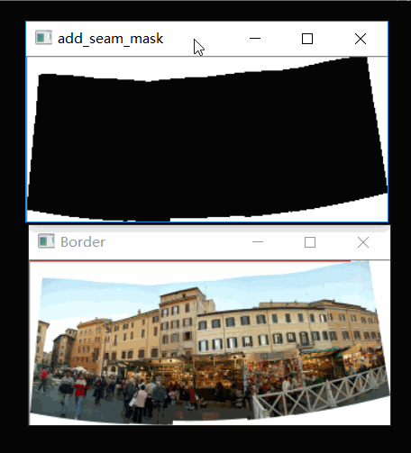
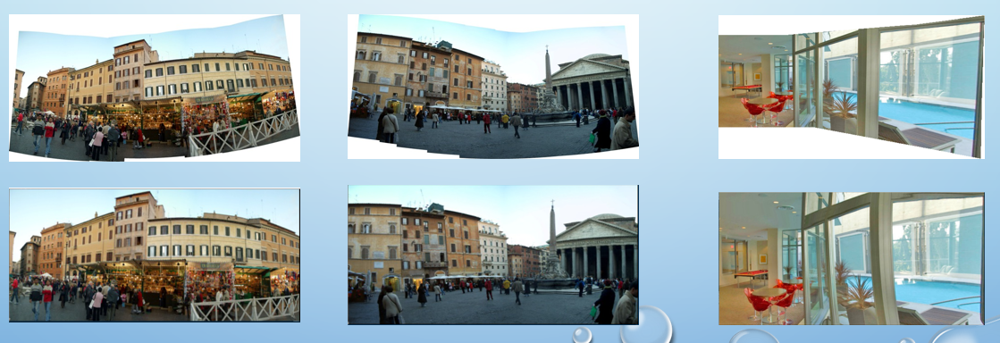
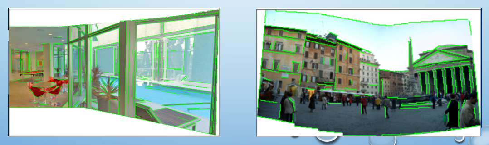
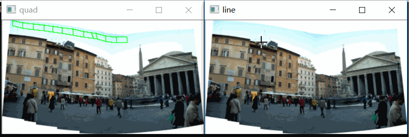

# rectangle-panoramic-image

> Author: Yuchao Gu

> E-mail: 2015014178@buct.edu.cn

> Date: 2018-07-31

> Description: My implementation of 《Rectangling Panoramic Images via Warping》,which is accelerated by OpenGL

- - -

# implementation

## Local Warping

### pipeline

### visiual results

## Global Warping

### shape perservation and line perservation

### line perservation

step 1: detect lines

step 2: segment lines in each quad

